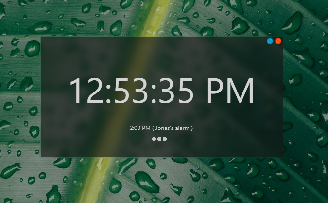
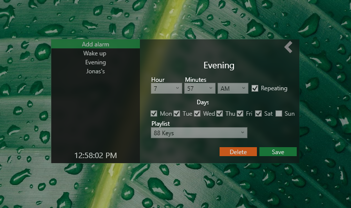

  

<h1> SpotifyAlarm </h1>
Spotify alarm is an application to launch Spotify and play the selected playlist! This application uses <a href="https://github.com/JohnnyCrazy/SpotifyAPI-NET"> SpotifyAPI-NET by JohnnyCrazy </a> to get playlists and local Spotify settings.

 

<h1> Features </h1>
- Wake up to your favorite Spotify playlist
- Start/Play Spotify from lock screen
- (To be added) Start SpotifyAlarm on startup

<h1> Appearance </h1>

  

  

