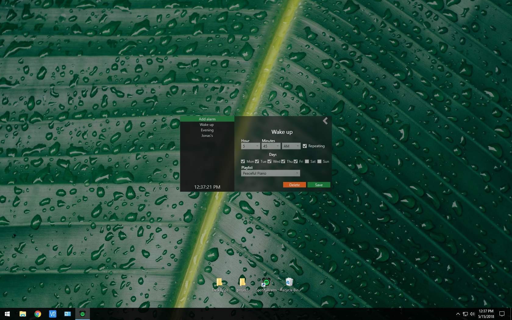

  

# SpotifyAlarm
Spotify alarm is an application to launch Spotify and play the selected playlist! This application uses <a href="https://github.com/JohnnyCrazy/SpotifyAPI-NET"> SpotifyAPI-NET by JohnnyCrazy </a> to get playlists and local Spotify settings.

# Appearance
I wanted the UI for SpotifyAlarm to be pleasing and simple.

  

  

