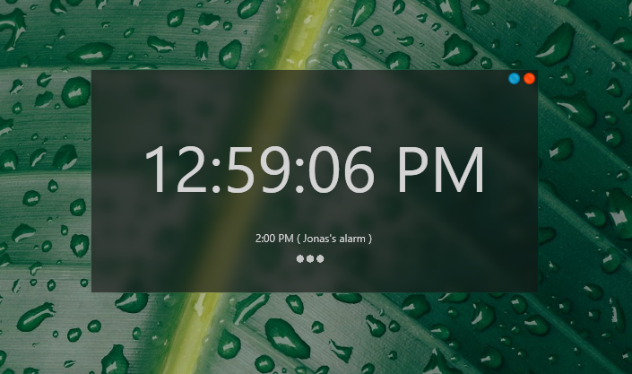

  

# SpotifyAlarm
Spotify alarm is an application to launch Spotify and play the selected playlist! This application uses <a href="https://github.com/JohnnyCrazy/SpotifyAPI-NET"> SpotifyAPI-NET by JohnnyCrazy </a> to get playlists and local Spotify settings.

# Appearance
My goal for the application UI was for it to be both simple and good looking

<h1 align="Center" > Main form </h1>

  

<h1 align="Center" > Edit Alarm form </h1>

  

